# Requirements index — `apps/QuarterCompany/requirements`

<!-- GENERATED by requirements/check.mjs — do not edit by hand. -->
<!-- Regenerate with `yarn requirements:build`. -->

| ID | Title | Status | Type | Priority | Source |
|---|---|---|---|---|---|
| [`REQ-QC-001`](qc.md#req-qc-001--the-journal-is-the-only-source-of-truth) | The journal is the only source of truth | active | constraint | P0 | sean |
| [`REQ-QC-002`](qc.md#req-qc-002--nothing-is-permanently-deleted) | Nothing is permanently deleted | active | constraint | P0 | sean |
| [`REQ-QC-003`](qc.md#req-qc-003--turn-labels-are-unpadded-and-sort-by-ordinal) | Turn labels are unpadded and sort by ordinal | active | constraint | P2 | sean |
| [`REQ-QC-004`](qc.md#req-qc-004--access-control-is-unix-accounts-groups-and-mode-bits) | Access control is Unix accounts, groups and mode bits | active | functional | P1 | sean |
| [`REQ-QC-005`](qc.md#req-qc-005--casts-assign-actors-to-seats-with-the-most-specific-rule) | Casts assign actors to seats, with the most specific rule | active | functional | P1 | sean |
| [`REQ-QC-006`](qc.md#req-qc-006--a-scenario-never-names-a-model) | A scenario never names a model | active | constraint | P2 | sean |
| [`REQ-QC-007`](qc.md#req-qc-007--mail-is-delivered-at-the-turn-boundary) | Mail is delivered at the turn boundary | active | functional | P1 | sean |
| [`REQ-QC-008`](qc.md#req-qc-008--seats-work-on-one-snapshot-and-merge-in-seat-id-order) | Seats work on one snapshot and merge in seat-id order | active | constraint | P0 | agent:SEAN-534 |
| [`REQ-QC-009`](qc.md#req-qc-009--tools-cost-simulated-minutes-from-a-fixed-turn-budget) | Tools cost simulated minutes from a fixed turn budget | active | functional | P1 | sean |
| [`REQ-QC-010`](qc.md#req-qc-010--each-tool-is-defined-once-for-every-transport) | Each tool is defined once for every transport | active | constraint | P2 | sean |
| [`REQ-QC-011`](qc.md#req-qc-011--playback-never-calls-a-model) | Playback never calls a model | active | functional | P1 | sean |
| [`REQ-QC-012`](qc.md#req-qc-012--a-retake-always-makes-a-new-timeline) | A retake always makes a new timeline | active | functional | P1 | sean |
| [`REQ-QC-013`](qc.md#req-qc-013--the-simulator-runs-on-linux-only) | The simulator runs on Linux only | withdrawn | constraint | P1 | sean |
| [`REQ-QC-014`](qc.md#req-qc-014--private-thoughts-never-enter-the-world) | Private thoughts never enter the world | active | constraint | P1 | sean |
| [`REQ-QC-015`](qc.md#req-qc-015--injected-mail-comes-only-from-outside-the-simulation) | Injected mail comes only from outside the simulation | superseded | constraint | P1 | sean |
| [`REQ-QC-016`](qc.md#req-qc-016--a-scenario-makes-a-seat-act-through-the-seats-own-session) | A scenario makes a seat act through the seat's own session | active | functional | P1 | sean |
| [`REQ-QC-017`](qc.md#req-qc-017--injects-are-system-events-never-people) | Injects are system events, never people | active | constraint | P0 | sean |
| [`REQ-QC-018`](qc.md#req-qc-018--the-world-is-closed-mail-to-an-unknown-domain-bounces) | The world is closed: mail to an unknown domain bounces | active | constraint | P1 | sean |
| [`REQ-QC-019`](qc.md#req-qc-019--blocked-mail-waits-in-a-queue-that-the-journal-holds) | Blocked mail waits in a queue that the journal holds | active | functional | P1 | agent:SEAN-548 |
| [`REQ-QC-020`](qc.md#req-qc-020--the-people-in-the-world-are-world-state) | The people in the world are world state | active | functional | P1 | sean |
| [`REQ-QC-021`](qc.md#req-qc-021--a-consultant-has-a-mailbox-at-the-employer-and-works-at-the-client) | A consultant has a mailbox at the employer and works at the client | active | functional | P2 | sean |
| [`REQ-QC-022`](qc.md#req-qc-022--a-population-is-one-journal-event-that-the-fold-expands) | A population is one journal event that the fold expands | active | functional | P1 | sean |
| [`REQ-QC-023`](qc.md#req-qc-023--a-population-acts-through-one-seeded-bulk-brain) | A population acts through one seeded bulk brain | active | functional | P1 | sean |
| [`REQ-QC-024`](qc.md#req-qc-024--a-model-writes-a-populations-mail-variants-once) | A model writes a population's mail variants once | active | functional | P2 | sean |
| [`REQ-QC-025`](qc.md#req-qc-025--a-turn-with-5000-members-and-500-mails-runs-in-seconds) | A turn with 5,000 members and 500 mails runs in seconds | active | quality | P2 | sean |
| [`REQ-QC-026`](qc.md#req-qc-026--a-case-system-is-a-business-tool-group-over-files) | A case system is a business tool group over files | active | functional | P1 | sean |
| [`REQ-QC-027`](qc.md#req-qc-027--the-case-system-takes-in-a-role-mailbox-and-replies-from-its-address) | The case system takes in a role mailbox and replies from its address | active | functional | P1 | sean |
| [`REQ-QC-028`](qc.md#req-qc-028--a-script-can-give-the-calls-for-a-range-of-turns) | A script can give the calls for a range of turns | active | functional | P2 | agent:SEAN-552 |
| [`REQ-QC-029`](qc.md#req-qc-029--the-recall-scenario-tells-its-story-with-no-model) | The recall scenario tells its story with no model | active | functional | P2 | sean |
| [`REQ-QC-030`](qc.md#req-qc-030--offline-mode-refuses-a-model-host-that-is-not-local) | Offline mode refuses a model host that is not local | active | constraint | P1 | sean |
| [`REQ-QC-031`](qc.md#req-qc-031--a-tool-call-that-the-brain-cannot-read-is-a-failed-action) | A tool call that the brain cannot read is a failed action | active | functional | P1 | sean |
| [`REQ-QC-032`](qc.md#req-qc-032--each-model-call-records-its-time-and-the-report-shows-time-and-tokens) | Each model call records its time, and the report shows time and tokens | active | functional | P2 | sean |
| [`REQ-QC-033`](qc.md#req-qc-033--one-local-model-serves-every-seat-one-request-at-a-time) | One local model serves every seat, one request at a time | active | functional | P2 | sean |
| [`REQ-QC-034`](qc.md#req-qc-034--a-full-run-works-on-one-pc-with-no-network) | A full run works on one PC with no network | active | quality | P1 | sean |
| [`REQ-QC-035`](qc.md#req-qc-035--a-run-can-be-watched-live-in-the-viewer) | A run can be watched live in the viewer | active | functional | P2 | sean |

## Dependency graph

```mermaid
graph TD
  REQ_QC_001["REQ-QC-001<br/>The journal is the only source of truth"]
  REQ_QC_002["REQ-QC-002<br/>Nothing is permanently deleted"]
  REQ_QC_003["REQ-QC-003<br/>Turn labels are unpadded and sort by ordinal"]
  REQ_QC_004["REQ-QC-004<br/>Access control is Unix accounts, groups and mode bits"]
  REQ_QC_005["REQ-QC-005<br/>Casts assign actors to seats, with the most specific rule"]
  REQ_QC_006["REQ-QC-006<br/>A scenario never names a model"]
  REQ_QC_007["REQ-QC-007<br/>Mail is delivered at the turn boundary"]
  REQ_QC_008["REQ-QC-008<br/>Seats work on one snapshot and merge in seat-id order"]
  REQ_QC_009["REQ-QC-009<br/>Tools cost simulated minutes from a fixed turn budget"]
  REQ_QC_010["REQ-QC-010<br/>Each tool is defined once for every transport"]
  REQ_QC_011["REQ-QC-011<br/>Playback never calls a model"]
  REQ_QC_012["REQ-QC-012<br/>A retake always makes a new timeline"]
  REQ_QC_013["REQ-QC-013<br/>The simulator runs on Linux only"]
  REQ_QC_014["REQ-QC-014<br/>Private thoughts never enter the world"]
  REQ_QC_015["REQ-QC-015<br/>Injected mail comes only from outside the simulation"]
  REQ_QC_016["REQ-QC-016<br/>A scenario makes a seat act through the seat's own session"]
  REQ_QC_017["REQ-QC-017<br/>Injects are system events, never people"]
  REQ_QC_018["REQ-QC-018<br/>The world is closed: mail to an unknown domain bounces"]
  REQ_QC_019["REQ-QC-019<br/>Blocked mail waits in a queue that the journal holds"]
  REQ_QC_020["REQ-QC-020<br/>The people in the world are world state"]
  REQ_QC_021["REQ-QC-021<br/>A consultant has a mailbox at the employer and works at the client"]
  REQ_QC_022["REQ-QC-022<br/>A population is one journal event that the fold expands"]
  REQ_QC_023["REQ-QC-023<br/>A population acts through one seeded bulk brain"]
  REQ_QC_024["REQ-QC-024<br/>A model writes a population's mail variants once"]
  REQ_QC_025["REQ-QC-025<br/>A turn with 5,000 members and 500 mails runs in seconds"]
  REQ_QC_026["REQ-QC-026<br/>A case system is a business tool group over files"]
  REQ_QC_027["REQ-QC-027<br/>The case system takes in a role mailbox and replies from its address"]
  REQ_QC_028["REQ-QC-028<br/>A script can give the calls for a range of turns"]
  REQ_QC_029["REQ-QC-029<br/>The recall scenario tells its story with no model"]
  REQ_QC_030["REQ-QC-030<br/>Offline mode refuses a model host that is not local"]
  REQ_QC_031["REQ-QC-031<br/>A tool call that the brain cannot read is a failed action"]
  REQ_QC_032["REQ-QC-032<br/>Each model call records its time, and the report shows time and tokens"]
  REQ_QC_033["REQ-QC-033<br/>One local model serves every seat, one request at a time"]
  REQ_QC_034["REQ-QC-034<br/>A full run works on one PC with no network"]
  REQ_QC_035["REQ-QC-035<br/>A run can be watched live in the viewer"]
  REQ_QC_007 -->|amended-by| REQ_QC_018
  REQ_QC_008 -->|depends-on| REQ_QC_001
  REQ_QC_014 -->|depends-on| REQ_QC_001
  REQ_QC_015 -->|superseded-by| REQ_QC_017
  REQ_QC_016 -->|depends-on| REQ_QC_008
  REQ_QC_017 -->|supersedes| REQ_QC_015
  REQ_QC_018 -->|amends| REQ_QC_007
  REQ_QC_019 -->|depends-on| REQ_QC_001
  REQ_QC_020 -->|depends-on| REQ_QC_001
  REQ_QC_020 -->|depends-on| REQ_QC_017
  REQ_QC_021 -->|depends-on| REQ_QC_020
  REQ_QC_022 -->|depends-on| REQ_QC_001
  REQ_QC_022 -->|depends-on| REQ_QC_020
  REQ_QC_023 -->|depends-on| REQ_QC_008
  REQ_QC_023 -->|depends-on| REQ_QC_017
  REQ_QC_023 -->|depends-on| REQ_QC_022
  REQ_QC_024 -->|depends-on| REQ_QC_006
  REQ_QC_024 -->|depends-on| REQ_QC_023
  REQ_QC_025 -->|depends-on| REQ_QC_023
  REQ_QC_026 -->|depends-on| REQ_QC_004
  REQ_QC_026 -->|depends-on| REQ_QC_009
  REQ_QC_026 -->|depends-on| REQ_QC_010
  REQ_QC_027 -->|depends-on| REQ_QC_023
  REQ_QC_027 -->|depends-on| REQ_QC_026
  REQ_QC_029 -->|depends-on| REQ_QC_020
  REQ_QC_029 -->|depends-on| REQ_QC_023
  REQ_QC_029 -->|depends-on| REQ_QC_026
  REQ_QC_029 -->|depends-on| REQ_QC_027
  REQ_QC_029 -->|depends-on| REQ_QC_028
  REQ_QC_030 -->|depends-on| REQ_QC_005
  REQ_QC_031 -->|depends-on| REQ_QC_008
  REQ_QC_031 -->|depends-on| REQ_QC_010
  REQ_QC_033 -->|depends-on| REQ_QC_008
  REQ_QC_034 -->|depends-on| REQ_QC_024
  REQ_QC_034 -->|depends-on| REQ_QC_030
  REQ_QC_034 -->|depends-on| REQ_QC_033
  REQ_QC_035 -->|depends-on| REQ_QC_001
  REQ_QC_035 -->|depends-on| REQ_QC_011
  style REQ_QC_013 stroke-dasharray: 4 4
  style REQ_QC_015 stroke-dasharray: 4 4
```

## Derived reverse links

- `REQ-QC-001` — required-by REQ-QC-008, required-by REQ-QC-014, required-by REQ-QC-019, required-by REQ-QC-020, required-by REQ-QC-022, required-by REQ-QC-035
- `REQ-QC-004` — required-by REQ-QC-026
- `REQ-QC-005` — required-by REQ-QC-030
- `REQ-QC-006` — required-by REQ-QC-024
- `REQ-QC-008` — required-by REQ-QC-016, required-by REQ-QC-023, required-by REQ-QC-031, required-by REQ-QC-033
- `REQ-QC-009` — required-by REQ-QC-026
- `REQ-QC-010` — required-by REQ-QC-026, required-by REQ-QC-031
- `REQ-QC-011` — required-by REQ-QC-035
- `REQ-QC-017` — required-by REQ-QC-020, required-by REQ-QC-023
- `REQ-QC-020` — required-by REQ-QC-021, required-by REQ-QC-022, required-by REQ-QC-029
- `REQ-QC-022` — required-by REQ-QC-023
- `REQ-QC-023` — required-by REQ-QC-024, required-by REQ-QC-025, required-by REQ-QC-027, required-by REQ-QC-029
- `REQ-QC-024` — required-by REQ-QC-034
- `REQ-QC-026` — required-by REQ-QC-027, required-by REQ-QC-029
- `REQ-QC-027` — required-by REQ-QC-029
- `REQ-QC-028` — required-by REQ-QC-029
- `REQ-QC-030` — required-by REQ-QC-034
- `REQ-QC-033` — required-by REQ-QC-034
