# Requirements index — `apps/QuarterCompany/requirements`

<!-- GENERATED by requirements/check.mjs — do not edit by hand. -->
<!-- Regenerate with `yarn requirements:build`. -->

| ID | Title | Status | Type | Priority | Source |
|---|---|---|---|---|---|
| [`REQ-QC-001`](qc.md#req-qc-001--the-journal-is-the-only-source-of-truth) | The journal is the only source of truth | active | constraint | P0 | sean |
| [`REQ-QC-002`](qc.md#req-qc-002--nothing-is-permanently-deleted) | Nothing is permanently deleted | active | constraint | P0 | sean |
| [`REQ-QC-003`](qc.md#req-qc-003--turn-labels-are-unpadded-and-sort-by-ordinal) | Turn labels are unpadded and sort by ordinal | active | constraint | P2 | sean |
| [`REQ-QC-004`](qc.md#req-qc-004--access-control-is-unix-accounts-groups-and-mode-bits) | Access control is Unix accounts, groups and mode bits | active | functional | P1 | sean |
| [`REQ-QC-005`](qc.md#req-qc-005--casts-assign-actors-to-seats-with-the-most-specific-rule) | Casts assign actors to seats, with the most specific rule | active | functional | P1 | sean |
| [`REQ-QC-006`](qc.md#req-qc-006--a-scenario-never-names-a-model) | A scenario never names a model | active | constraint | P2 | sean |
| [`REQ-QC-007`](qc.md#req-qc-007--mail-is-delivered-at-the-turn-boundary) | Mail is delivered at the turn boundary | active | functional | P1 | sean |
| [`REQ-QC-008`](qc.md#req-qc-008--seats-work-on-one-snapshot-and-merge-in-seat-id-order) | Seats work on one snapshot and merge in seat-id order | active | constraint | P0 | agent:SEAN-534 |
| [`REQ-QC-009`](qc.md#req-qc-009--tools-cost-simulated-minutes-from-a-fixed-turn-budget) | Tools cost simulated minutes from a fixed turn budget | active | functional | P1 | sean |
| [`REQ-QC-010`](qc.md#req-qc-010--each-tool-is-defined-once-for-every-transport) | Each tool is defined once for every transport | active | constraint | P2 | sean |
| [`REQ-QC-011`](qc.md#req-qc-011--playback-never-calls-a-model) | Playback never calls a model | active | functional | P1 | sean |
| [`REQ-QC-012`](qc.md#req-qc-012--a-retake-always-makes-a-new-timeline) | A retake always makes a new timeline | active | functional | P1 | sean |
| [`REQ-QC-013`](qc.md#req-qc-013--the-simulator-runs-on-linux-only) | The simulator runs on Linux only | active | constraint | P1 | sean |

## Dependency graph

```mermaid
graph TD
  REQ_QC_001["REQ-QC-001<br/>The journal is the only source of truth"]
  REQ_QC_002["REQ-QC-002<br/>Nothing is permanently deleted"]
  REQ_QC_003["REQ-QC-003<br/>Turn labels are unpadded and sort by ordinal"]
  REQ_QC_004["REQ-QC-004<br/>Access control is Unix accounts, groups and mode bits"]
  REQ_QC_005["REQ-QC-005<br/>Casts assign actors to seats, with the most specific rule"]
  REQ_QC_006["REQ-QC-006<br/>A scenario never names a model"]
  REQ_QC_007["REQ-QC-007<br/>Mail is delivered at the turn boundary"]
  REQ_QC_008["REQ-QC-008<br/>Seats work on one snapshot and merge in seat-id order"]
  REQ_QC_009["REQ-QC-009<br/>Tools cost simulated minutes from a fixed turn budget"]
  REQ_QC_010["REQ-QC-010<br/>Each tool is defined once for every transport"]
  REQ_QC_011["REQ-QC-011<br/>Playback never calls a model"]
  REQ_QC_012["REQ-QC-012<br/>A retake always makes a new timeline"]
  REQ_QC_013["REQ-QC-013<br/>The simulator runs on Linux only"]
  REQ_QC_008 -->|depends-on| REQ_QC_001
```

## Derived reverse links

- `REQ-QC-001` — required-by REQ-QC-008
