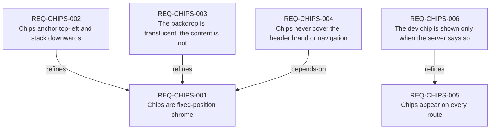

# Requirements index — `apps/inside/requirements`

<!-- GENERATED by requirements/check.mjs — do not edit by hand. -->
<!-- Regenerate with `yarn requirements:build`. -->

| ID | Title | Status | Type | Priority | Source |
|---|---|---|---|---|---|
| [`REQ-CHIPS-001`](chips.md#req-chips-001--chips-are-fixed-position-chrome) | Chips are fixed-position chrome | active | constraint | P2 | sean |
| [`REQ-CHIPS-002`](chips.md#req-chips-002--chips-anchor-top-left-and-stack-downwards) | Chips anchor top-left and stack downwards | active | constraint | P3 | sean |
| [`REQ-CHIPS-003`](chips.md#req-chips-003--the-backdrop-is-translucent-the-content-is-not) | The backdrop is translucent, the content is not | active | quality | P2 | sean |
| [`REQ-CHIPS-004`](chips.md#req-chips-004--chips-never-cover-the-header-brand-or-navigation) | Chips never cover the header brand or navigation | active | constraint | P1 | sean |
| [`REQ-CHIPS-005`](chips.md#req-chips-005--chips-appear-on-every-route) | Chips appear on every route | active | functional | P3 | sean |
| [`REQ-CHIPS-006`](chips.md#req-chips-006--the-dev-chip-is-shown-only-when-the-server-says-so) | The dev chip is shown only when the server says so | active | constraint | P1 | sean |

## Dependency graph

## Derived reverse links

- `REQ-CHIPS-001` — refined-by REQ-CHIPS-002, refined-by REQ-CHIPS-003, required-by REQ-CHIPS-004
- `REQ-CHIPS-005` — refined-by REQ-CHIPS-006
