# Requirements index — `utils/debbie/2026-09-17/requirements`

<!-- GENERATED by requirements/check.mjs — do not edit by hand. -->
<!-- Regenerate with `yarn requirements:build`. -->

| ID | Title | Status | Type | Priority | Source |
|---|---|---|---|---|---|
| [`REQ-DEPLOY-001`](deploy.md#req-deploy-001--production-tracks-a-branch-that-only-moves-deliberately) | Production tracks a branch that only moves deliberately | active | constraint | P0 | sean |
| [`REQ-DEPLOY-002`](deploy.md#req-deploy-002--a-deploy-needs-no-access-to-the-host) | A deploy needs no access to the host | active | functional | P0 | sean |
| [`REQ-DEPLOY-003`](deploy.md#req-deploy-003--two-deploys-cannot-run-at-once) | Two deploys cannot run at once | active | constraint | P1 | sean |
| [`REQ-DEPLOY-004`](deploy.md#req-deploy-004--a-deploy-is-the-same-command-a-human-would-run) | A deploy is the same command a human would run | active | constraint | P1 | sean |
| [`REQ-DEPLOY-005`](deploy.md#req-deploy-005--the-tunnel-restarts-only-when-its-own-configuration-changes) | The tunnel restarts only when its own configuration changes | active | constraint | P2 | sean |
| [`REQ-DEPLOY-006`](deploy.md#req-deploy-006--a-deploy-leaves-untracked-credentials-alone) | A deploy leaves untracked credentials alone | active | constraint | P0 | sean |
| [`REQ-EMU-001`](emu.md#req-emu-001--an-accelerator-is-never-assumed-from-the-host-alone) | An accelerator is never assumed from the host alone | active | constraint | P0 | sean |
| [`REQ-EMU-002`](emu.md#req-emu-002--an-install-completes-without-being-watched) | An install completes without being watched | active | functional | P0 | sean |
| [`REQ-EMU-003`](emu.md#req-emu-003--the-harness-reports-by-exit-code) | The harness reports by exit code | active | constraint | P1 | sean |
| [`REQ-EMU-004`](emu.md#req-emu-004--the-guest-boots-the-way-the-hardware-does) | The guest boots the way the hardware does | active | constraint | P1 | sean |
| [`REQ-EMU-005`](emu.md#req-emu-005--one-preseed-serves-both-architectures) | One preseed serves both architectures | active | constraint | P1 | sean |
| [`REQ-NETWORK-001`](network.md#req-network-001--nothing-is-published-by-opening-a-port) | Nothing is published by opening a port | active | constraint | P0 | sean |
| [`REQ-NETWORK-002`](network.md#req-network-002--ingress-rules-live-in-the-repository) | Ingress rules live in the repository | active | constraint | P1 | sean |
| [`REQ-NETWORK-003`](network.md#req-network-003--a-link-with-carrier-but-no-route-is-treated-as-dead) | A link with carrier but no route is treated as dead | active | functional | P0 | sean |
| [`REQ-NETWORK-004`](network.md#req-network-004--the-failover-watchdog-and-the-wifi-configuration-agree-on-an-owner) | The failover watchdog and the wifi configuration agree on an owner | proposed | constraint | P1 | sean |
| [`REQ-NETWORK-005`](network.md#req-network-005--the-host-is-reachable-over-ssh-from-outside-the-local-network) | The host is reachable over SSH from outside the local network | active | functional | P1 | sean |
| [`REQ-SERVER-001`](server.md#req-server-001--no-local-event-takes-the-server-down) | No local event takes the server down | active | constraint | P0 | sean |
| [`REQ-SERVER-002`](server.md#req-server-002--only-four-ports-are-reachable) | Only four ports are reachable | active | constraint | P1 | sean |
| [`REQ-SERVER-003`](server.md#req-server-003--the-deploy-user-can-deploy-without-a-password) | The deploy user can deploy without a password | active | functional | P1 | sean |
| [`REQ-SERVER-004`](server.md#req-server-004--the-host-is-reachable-by-name-on-the-local-network) | The host is reachable by name on the local network | active | functional | P2 | sean |
| [`REQ-SERVER-005`](server.md#req-server-005--a-wifi-only-host-keeps-its-network-across-a-reboot) | A wifi-only host keeps its network across a reboot | active | functional | P1 | sean |
| [`REQ-SERVER-006`](server.md#req-server-006--security-updates-apply-without-anyone-logging-in) | Security updates apply without anyone logging in | active | functional | P1 | sean |
| [`REQ-SERVER-007`](server.md#req-server-007--logs-cannot-fill-the-disk) | Logs cannot fill the disk | active | constraint | P2 | sean |
| [`REQ-SERVER-008`](server.md#req-server-008--ssh-accepts-keys-and-nothing-else) | SSH accepts keys and nothing else | active | constraint | P0 | sean |
| [`REQ-SERVER-009`](server.md#req-server-009--repeated-failed-authentication-is-throttled) | Repeated failed authentication is throttled | withdrawn | functional | P2 | sean |
| [`REQ-SERVER-010`](server.md#req-server-010--the-interactive-shell-is-the-one-described-in-the-repository) | The interactive shell is the one described in the repository | active | quality | P3 | sean |
| [`REQ-SERVER-011`](server.md#req-server-011--our-systemd-units-live-apart-from-the-distributions) | Our systemd units live apart from the distribution's | active | constraint | P2 | sean |
| [`REQ-SERVER-012`](server.md#req-server-012--a-packaged-unit-is-changed-by-drop-in-never-by-shadowing) | A packaged unit is changed by drop-in, never by shadowing | active | constraint | P1 | sean |
| [`REQ-SERVER-013`](server.md#req-server-013--our-units-are-identifiable-in-systemctl-output) | Our units are identifiable in systemctl output | active | constraint | P2 | sean |
| [`REQ-SERVER-014`](server.md#req-server-014--a-forgotten-setting-never-switches-anything-on) | A forgotten setting never switches anything on | active | constraint | P0 | sean |

## Dependency graph

```mermaid
graph TD
  REQ_DEPLOY_001["REQ-DEPLOY-001<br/>Production tracks a branch that only moves deliberately"]
  REQ_DEPLOY_002["REQ-DEPLOY-002<br/>A deploy needs no access to the host"]
  REQ_DEPLOY_003["REQ-DEPLOY-003<br/>Two deploys cannot run at once"]
  REQ_DEPLOY_004["REQ-DEPLOY-004<br/>A deploy is the same command a human would run"]
  REQ_DEPLOY_005["REQ-DEPLOY-005<br/>The tunnel restarts only when its own configuration changes"]
  REQ_DEPLOY_006["REQ-DEPLOY-006<br/>A deploy leaves untracked credentials alone"]
  REQ_EMU_001["REQ-EMU-001<br/>An accelerator is never assumed from the host alone"]
  REQ_EMU_002["REQ-EMU-002<br/>An install completes without being watched"]
  REQ_EMU_003["REQ-EMU-003<br/>The harness reports by exit code"]
  REQ_EMU_004["REQ-EMU-004<br/>The guest boots the way the hardware does"]
  REQ_EMU_005["REQ-EMU-005<br/>One preseed serves both architectures"]
  REQ_NETWORK_001["REQ-NETWORK-001<br/>Nothing is published by opening a port"]
  REQ_NETWORK_002["REQ-NETWORK-002<br/>Ingress rules live in the repository"]
  REQ_NETWORK_003["REQ-NETWORK-003<br/>A link with carrier but no route is treated as dead"]
  REQ_NETWORK_004["REQ-NETWORK-004<br/>The failover watchdog and the wifi configuration agree on an owner"]
  REQ_NETWORK_005["REQ-NETWORK-005<br/>The host is reachable over SSH from outside the local network"]
  REQ_SERVER_001["REQ-SERVER-001<br/>No local event takes the server down"]
  REQ_SERVER_002["REQ-SERVER-002<br/>Only four ports are reachable"]
  REQ_SERVER_003["REQ-SERVER-003<br/>The deploy user can deploy without a password"]
  REQ_SERVER_004["REQ-SERVER-004<br/>The host is reachable by name on the local network"]
  REQ_SERVER_005["REQ-SERVER-005<br/>A wifi-only host keeps its network across a reboot"]
  REQ_SERVER_006["REQ-SERVER-006<br/>Security updates apply without anyone logging in"]
  REQ_SERVER_007["REQ-SERVER-007<br/>Logs cannot fill the disk"]
  REQ_SERVER_008["REQ-SERVER-008<br/>SSH accepts keys and nothing else"]
  REQ_SERVER_009["REQ-SERVER-009<br/>Repeated failed authentication is throttled"]
  REQ_SERVER_010["REQ-SERVER-010<br/>The interactive shell is the one described in the repository"]
  REQ_SERVER_011["REQ-SERVER-011<br/>Our systemd units live apart from the distribution's"]
  REQ_SERVER_012["REQ-SERVER-012<br/>A packaged unit is changed by drop-in, never by shadowing"]
  REQ_SERVER_013["REQ-SERVER-013<br/>Our units are identifiable in systemctl output"]
  REQ_SERVER_014["REQ-SERVER-014<br/>A forgotten setting never switches anything on"]
  REQ_DEPLOY_002 -->|depends-on| REQ_DEPLOY_001
  REQ_DEPLOY_003 -->|depends-on| REQ_DEPLOY_002
  REQ_DEPLOY_004 -->|depends-on| REQ_DEPLOY_002
  REQ_DEPLOY_005 -->|depends-on| REQ_DEPLOY_004
  REQ_DEPLOY_006 -->|depends-on| REQ_DEPLOY_004
  REQ_NETWORK_002 -->|depends-on| REQ_NETWORK_001
  REQ_NETWORK_002 -->|depends-on| REQ_DEPLOY_005
  REQ_NETWORK_002 -->|depends-on| REQ_DEPLOY_006
  REQ_NETWORK_003 -->|depends-on| REQ_NETWORK_001
  REQ_NETWORK_004 -->|refines| REQ_SERVER_005
  REQ_NETWORK_004 -->|depends-on| REQ_NETWORK_003
  REQ_NETWORK_005 -->|depends-on| REQ_NETWORK_001
  REQ_NETWORK_005 -->|depends-on| REQ_SERVER_008
  REQ_SERVER_008 -->|depends-on| REQ_SERVER_002
  REQ_SERVER_008 -->|depends-on| REQ_SERVER_003
  REQ_SERVER_009 -->|refines| REQ_SERVER_008
  REQ_SERVER_012 -->|depends-on| REQ_SERVER_011
  REQ_SERVER_013 -->|depends-on| REQ_SERVER_011
  REQ_SERVER_014 -->|refines| REQ_DEPLOY_002
  REQ_SERVER_014 -->|refines| REQ_NETWORK_002
  style REQ_SERVER_009 stroke-dasharray: 4 4
```

## Derived reverse links

- `REQ-DEPLOY-001` — required-by REQ-DEPLOY-002
- `REQ-DEPLOY-002` — required-by REQ-DEPLOY-003, required-by REQ-DEPLOY-004, refined-by REQ-SERVER-014
- `REQ-DEPLOY-004` — required-by REQ-DEPLOY-005, required-by REQ-DEPLOY-006
- `REQ-DEPLOY-005` — required-by REQ-NETWORK-002
- `REQ-DEPLOY-006` — required-by REQ-NETWORK-002
- `REQ-NETWORK-001` — required-by REQ-NETWORK-002, required-by REQ-NETWORK-003, required-by REQ-NETWORK-005
- `REQ-NETWORK-002` — refined-by REQ-SERVER-014
- `REQ-NETWORK-003` — required-by REQ-NETWORK-004
- `REQ-SERVER-002` — required-by REQ-SERVER-008
- `REQ-SERVER-003` — required-by REQ-SERVER-008
- `REQ-SERVER-005` — refined-by REQ-NETWORK-004
- `REQ-SERVER-008` — required-by REQ-NETWORK-005, refined-by REQ-SERVER-009
- `REQ-SERVER-011` — required-by REQ-SERVER-012, required-by REQ-SERVER-013
