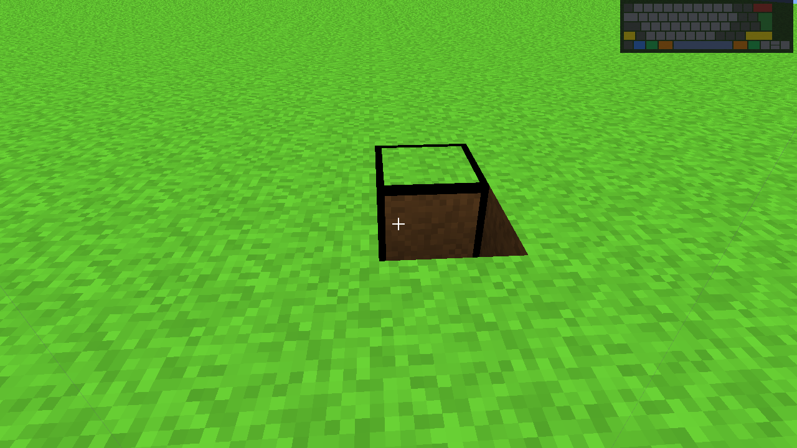
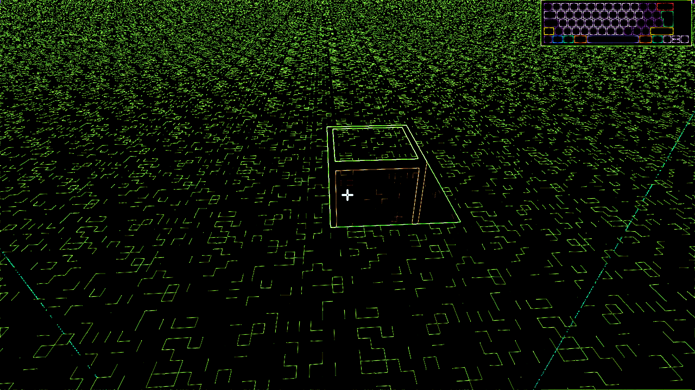
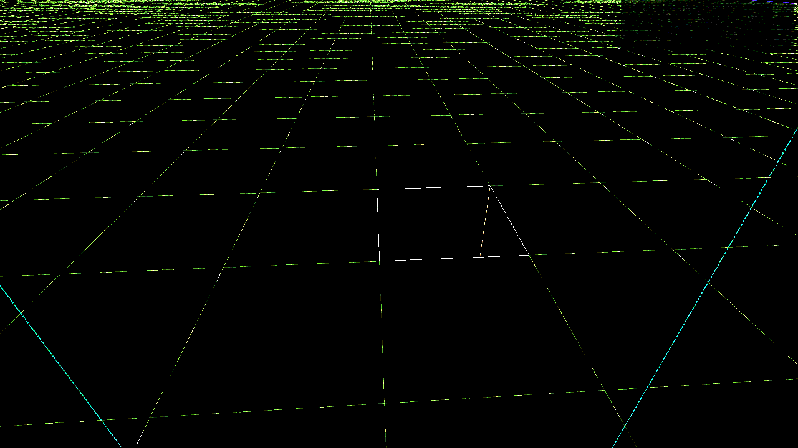
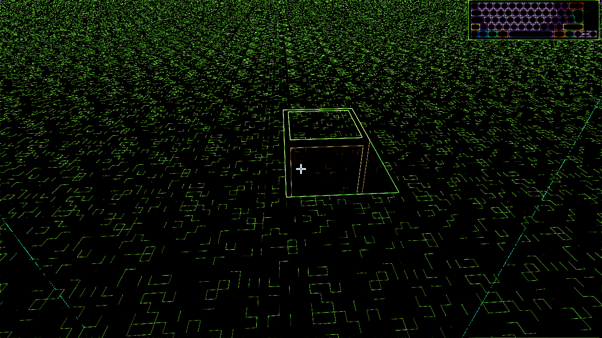
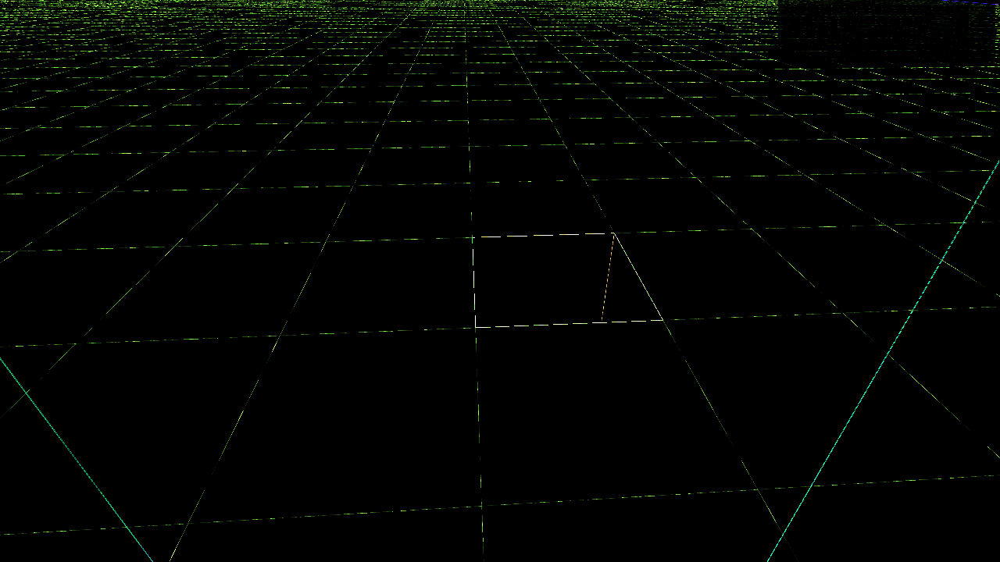

# Anti-Aliasing for Voxel Worlds

**TL;DR:** 4× MSAA only smooths geometry silhouettes — which for a voxel world
means the ~3% of pixels that sit on the outermost terrain outline. FXAA detects
screen-space luminance edges and covers ~17% of pixels including block-on-block
interior edges, which MSAA physically cannot touch. FXAA is the recommended
default for voxel scenes; MSAA remains available via `--aa=msaa --msaa=N`.

---

## Visual Comparison

All captures are the flatland TAS end-state at 1280×720 from the same camera.

| None | FXAA | MSAA 4× |
|------|------|---------|
|  |  |  |

### Diff — normalized (brightest delta stretched to white)

Best for answering "are there any differences at all?". `-normalize` finds the
max channel delta in the frame (~95 for FXAA here) and linearly stretches that
to 255, so faint sub-pixel blends become highly visible.

| FXAA vs None | MSAA vs None |
|--------------|--------------|
|  |  |

### Diff — amplified ×20 (relative magnitudes preserved)

Best for comparing the two methods side-by-side. Each channel delta is multiplied
by 20 (clamped at 255), so a delta of 5 → 100, 10 → 200, 13+ → white. Unlike
`-normalize`, the two images share the same scale, so you can compare FXAA's
coverage to MSAA's coverage directly.

| FXAA vs None | MSAA vs None |
|--------------|--------------|
|  |  |

FXAA's diff is dense across the full terrain — every block-on-block transition
gets touched. MSAA's diff is thin and concentrated on the horizon silhouette
with a few interior spots where three blocks meet at a depth discontinuity.

---

## Baseline (2026-04-11, flatland 1280×720)

| Comparison | Differing pixels | % of frame | Max channel Δ |
|------------|------------------|------------|----------------|
| none → fxaa  | 156,603 / 921,600 | **16.99%** | 94  |
| none → msaa4 | 32,079 / 921,600  | **3.48%**  | 105 |

FXAA touches roughly **4.9×** more pixels than 4× MSAA in this scene.

These numbers drift when the scene, shader, or FXAA tuning changes. The
regression script (`examples/voxel/tests/aa_regression.sh`) prints them fresh
on every run.

---

## What MSAA Can and Cannot Do

MSAA works at the **rasterizer** level: it fires multiple sub-pixel samples per
pixel and averages them. It only produces intermediate colours at **geometry
silhouette edges** — pixels that straddle two different triangles.

- ✅ **Outer silhouette edges** (block vs sky/fog): MSAA averages the block
  colour with the background. Visible as a 1-pixel-wide blend strip.
- ❌ **Block-on-block interior edges** (two adjacent opaque blocks touching):
  both triangle sides are solid geometry at the same/close depth. All 4×
  sub-samples hit geometry, so the coverage fraction is 0% or 100%. No
  blending occurs.

For a voxel world, the vast majority of visible edges are block-on-block
interior edges (flat terrain faces, cliff faces, etc.). Only the outermost
silhouette edges get smoothed. In practice, 4× MSAA on a voxel world affects
**~3% of pixels** in a typical scene — matching the baseline above.

### Why the olive/green edge is correct MSAA behaviour, not a bug

Sean noticed a specific effect (2026-04-11): the boundary between a lit grass
top and a dug hole's dark side face shows an olive/muddy band. This is correct:

- Grass-top blocks are bright green, ~`RGB(102, 131, 36)` in sRGB.
- Hole side faces are near-black due to maximum AO: ~`RGB(38, 4, 4)`.
- At the diagonal silhouette, a boundary pixel has 2/4 sub-samples hitting the
  grass-top and 2/4 hitting the dark side. The blend is
  `(102+38)/2, (131+4)/2, (36+4)/2` ≈ `(72, 71, 21)` — olive.
- Without MSAA the centre sample decides: one side is solid green, the other
  solid near-black, with a hard aliased step between them.
- The olive blend looks garish because the AO floor (`0.4 + ao * 0.6`) plus
  ambient+diffuse lighting drops occluded side faces to near-black while the
  lit grass top is fully saturated green. The extreme contrast makes the
  sub-pixel blend traverse a wide colour space.

**This is not a mesh gap.** The mesher uses `@floatFromInt(world_coord)` for
all vertex positions; IEEE 754 f32 is exact for integers ≤ 2²³, so adjacent
faces share mathematically identical coordinates.

---

## Why FXAA Wins for Voxel Scenes

FXAA (Fast Approximate Anti-Aliasing) runs as a post-process pass on the final
colour image. It detects **luminance discontinuities in screen space**, which
means it catches every colour edge — including the block-on-block interior
edges MSAA physically cannot touch.

- One extra screen-space pass, 1 sample/pixel (cheap).
- Catches ALL perceivable edges, not just geometry silhouettes.
- Downside: blurs fine details (text, thin lines, crisp texel noise). For a
  voxel world with procedural texel noise this is acceptable — the noise is
  meant to look low-res anyway.

MSAA and FXAA can coexist: render to an MSAA texture, resolve to an
intermediate texture, then FXAA over that. For most voxel scenes the
FXAA-only route gives a bigger visible win per GPU cost.

---

## FXAA Implementation Architecture

`--aa=fxaa` activates a two-pass pipeline:

1. **Scene pass.** The voxel scene renders to an offscreen `bgra8unorm`
   texture (`fxaa_color_texture`, usage `render_attachment | texture_binding`)
   instead of the swapchain surface.
2. **FXAA pass.** After `pass.end()`, `runFXAAPass` blits that texture to the
   swapchain via a fullscreen triangle (3 vertices from `@builtin(vertex_index)`,
   no vertex buffer).

The FXAA shader is embedded via `@embedFile("fxaa.wgsl")` in
`sw_gpu/src/gpu.zig`. The WGSL is a port of the public-domain FXAA 3.11.

---

## Regenerating the Diffs

The regression script (`examples/voxel/tests/aa_regression.sh`) is the
canonical runner — it handles the build + all three captures + both diff
variants + coverage stats in one command:

```bash
./examples/voxel/tests/aa_regression.sh                 # run + print stats
./examples/voxel/tests/aa_regression.sh --output-dir docs/assets  # refresh the embedded PNGs
```

The raw `magick` invocations the script wraps are below, kept in one place so
they don't drift across the codebase. Run them by hand if you want to tweak
flags.

```bash
# 1. Build
zig build native -Dexample=voxel

# 2. Capture three frames in the same TAS state
./zig-out/bin/voxel --world=flatland --aa=none  --tas examples/voxel/tests/msaa_flatland.tas --dump-frame=/tmp/aa_none.ppm
./zig-out/bin/voxel --world=flatland --aa=fxaa  --tas examples/voxel/tests/msaa_flatland.tas --dump-frame=/tmp/aa_fxaa.ppm
./zig-out/bin/voxel --world=flatland --aa=msaa --msaa=4 --tas examples/voxel/tests/msaa_flatland.tas --dump-frame=/tmp/aa_msaa.ppm

# 3a. Normalized diffs — stretches the brightest delta to white.
#     Best for "are there any differences?" Each image is independently scaled,
#     so FXAA and MSAA diffs are NOT directly comparable by brightness.
magick /tmp/aa_none.ppm /tmp/aa_fxaa.ppm -compose difference -composite -normalize docs/assets/diff_fxaa_norm.png
magick /tmp/aa_none.ppm /tmp/aa_msaa.ppm -compose difference -composite -normalize docs/assets/diff_msaa_norm.png

# 3b. Amplified ×20 — preserves relative magnitudes (delta=5→100, delta=10→200).
#     Best for comparing FXAA coverage vs MSAA coverage side-by-side on the
#     same scale.
magick /tmp/aa_none.ppm /tmp/aa_fxaa.ppm -compose difference -composite -evaluate Multiply 20 docs/assets/diff_fxaa_amp20.png
magick /tmp/aa_none.ppm /tmp/aa_msaa.ppm -compose difference -composite -evaluate Multiply 20 docs/assets/diff_msaa_amp20.png
```

Use `-normalize` when the question is "did anything change?" and `-evaluate
Multiply N` when the question is "how much does FXAA cover vs MSAA?".
